# 浙江大学学习资源共享平台使用现状与优化路径调研报告

> 基于222份有效问卷的实证分析
> 2026年5月 LRSP团队呈现

## **摘要**

为系统厘清浙江大学在校生学习资源获取行为特征、渠道偏好与核心痛点，破解校内学习资源共享效率偏低、质量参差不齐等问题，本研究于 2026 年 5 月面向浙江大学大一至研究生全学段、多院系学生开展专项问卷调研，共回收有效问卷 222 份。

调研数据显示，浙大学生对课程笔记、历年真题等非正式学习资源需求刚性且高频，89.2% 受访者使用过校内学习资源平台，其中 CC98 论坛以 86.0% 的使用率占据绝对主导地位，GitHub、个人网页等平台因技术门槛、维护不足等因素未能形成规模效应。现有平台痛点呈现共性与差异并存特征，搜索不便、内容冗余、格式不兼容为跨平台突出问题，CC98、GitHub、文档类平台分别面临信息筛选难、权限壁垒高、资源失效多等差异化困境。85.6% 受访者具备资源分享意愿，偏好金钱型、实物型务实激励；对理想学习资源平台的核心诉求集中于检索高效、操作便捷、内容更新及时、运营规范有序。

基于上述结论，本研究提出针对性优化思路，主张重构结构化检索体系、简化资源上传流程、搭建分层务实的激励机制、建立常态化内容治理模式，并依托校园社交网络推进平台推广，为浙江大学构建高效、规范、可持续的学习资源共享平台提供核心依据与实践方向。

## **一、调研设计与样本概况**

### **1.1 调研背景与目的**

近年来，随着高校课程体系的不断丰富和学业压力的持续增加，学生对课程笔记、历年真题、学习经验等非正式学习资源的需求日趋强烈。浙江大学作为国内顶尖综合性大学，其学生在获取这类资源时主要依赖CC98论坛、GitHub开源仓库、个人搭建的网页平台、百度文库等商业文档平台，以及QQ/微信群等社交渠道。然而，这些渠道在资源质量、搜索效率、持续维护等方面参差不齐，学生的实际使用体验并不理想。

本次调研旨在系统摸底浙大学生获取学习资源的行为模式、渠道偏好与核心痛点，为后续搭建一个更高效、更可持续的学习资源共享平台提供决策依据。问卷于2026年5月通过微信渠道发放，有效回收222份，覆盖了平台使用现状、各平台使用目的与痛点、信息传播路径、运营问题感知、分享意愿与激励偏好、理想平台特征等多个维度。

### **1.2 样本结构分析**

从年级分布来看，222名受访者中大三学生占比最高（27.9%，62人），其次是研究生群体（25.2%，56人）和大二学生（18.9%，42人），大一和大四分别占17.1%和10.8%。整体上，中高年级及研究生群体占据了受访者的主体，这与这批学生对学习资料有更强的刚性需求是一致的。大一新生虽然占比不低，但他们对校内资源平台的认知和使用深度相对有限。

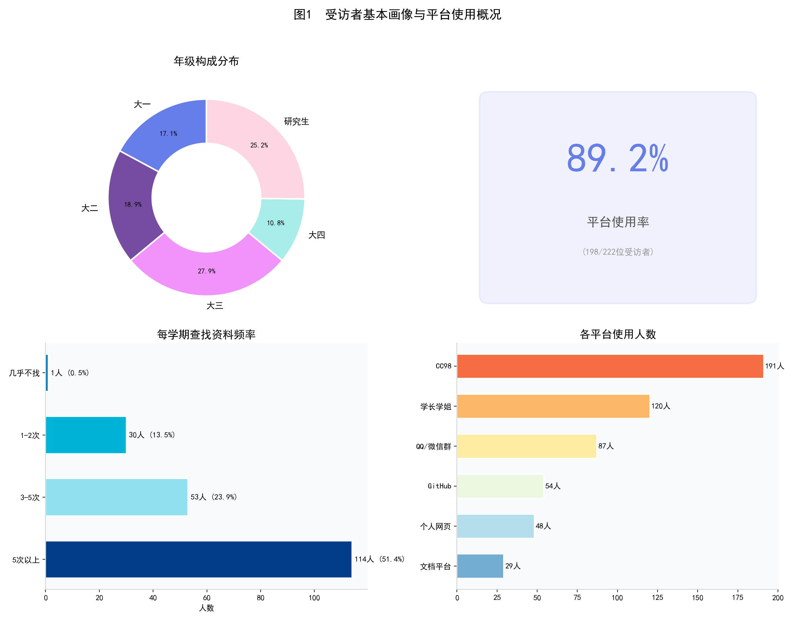

从设备端来看，利用问卷末尾采集的User-Agent信息进行分析，96.8%的受访者通过手机端（微信内嵌浏览器）完成了问卷填写。这一数据侧面反映了浙大学生日常信息获取**高度依赖移动端**的现实——一个学习资源平台如果在手机端体验不佳，几乎等于放弃了绝大多数轻量化信息的获取途径。

## **二、平台使用现状**

### **2.1 总体使用率与频率**

在222名受访者中，198人（89.2%）表示使用过校内学习资源平台，仅24人（10.8%）从未使用。这说明校内资源共享的需求端已经高度成熟，绝大多数学生都有过主动寻找课程资料的经历。

从使用频率来看，在198名使用者中，每学期查找5次以上的占57.6%（114人），3-5次的占26.8%（53人），两者合计84.3%。这意味着超过八成的使用者属于中高频用户。仅有1人表示"几乎不找"，**整体使用活跃度相当高。**

### **2.2 资源平台格局：CC98独领风骚，各平台各有优劣**

在六个主要资源获取渠道中，CC98论坛以191人次的使用量（占使用者的96.5%）遥遥领先，其优势之大可以用**"一家独大"** 来形容。排名第二的是"询问学长学姐/同级同学"（120人次，60.6%），这一人际传播渠道的高比例说明浙大学生获取资源仍在很大程度上**依赖社交关系网络**。QQ/微信群文件排名第三（87人次，43.9%），这类即时通讯群组承担了相当程度的资源分发功能。GitHub开源仓库（54人次，27.3%）、个人网页平台（48人次，24.2%）和商业文档平台（29人次，14.6%）的使用率则明显偏低。

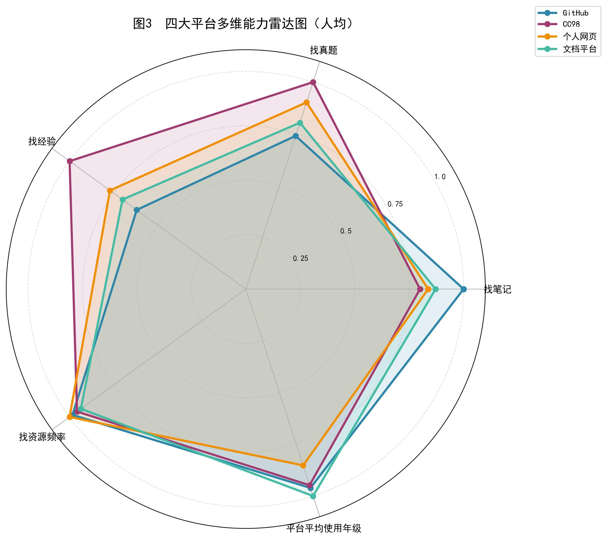

从雷达图的多维度对比来看，四大平台在不同学习场景中的功能定位呈现出清晰的分化特征：

CC98 在 “找真题” 与 “找经验” 两个维度上表现显著领先，体现出其作为校内社群，在备考信息、学长学姐经验分享类内容上的独特优势，是用户获取针对性备考资源的核心渠道；**但其“找笔记”维度却落后于其他所有媒介，可能是因为其非结构化的论坛结构，这也为其他资源平台留出了重要的生态位。**

GitHub 则在 “找笔记” 维度上得分突出，明显高于其他平台，反映出其在结构化、成体系的学习笔记资源上的价值，用户更倾向于在此获取整理规范的资料。

在 “找资源频率” 上，四大平台的表现差异相对较小，说明用户获取资源的频次与平台使用的年级分布，并未因平台不同产生显著分化，整体使用习惯较为一致。

## **三、使用痛点深度分析**

### **3.1 技术层面的问题：搜索与内容呈现痛点突出**

调研对GitHub、CC98、个人网页、文档平台和QQ/微信群五个渠道分别设置了六项痛点选项。从汇总数据来看，"找不到需要的资源/搜索不方便"和"手机端不友好/手机端体验差"是出现频率最高的两类痛点，几乎在每个平台上都位列前三。这说明搜索效率和移动端适配是跨平台的基础性问题。

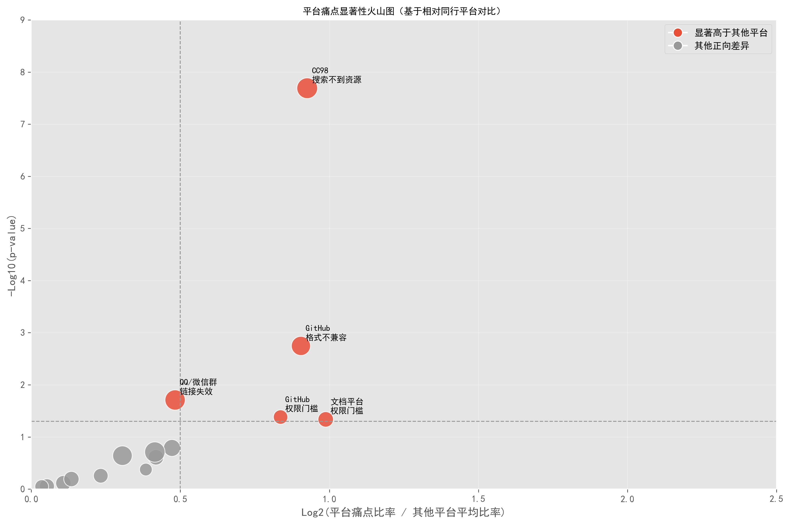

下面进行平台差异化对比研究。火山图以Log2(Fold Change)为横轴、-Log10(P值)为纵轴，将各平台各痛点的偏离程度和统计显著性进行了联合可视化。图中红色标记的点表示该平台在该痛点上的发生率显著高于全平台均值。几个关键发现浮出水面：

第一，CC98在"搜索不到资源"这一痛点上的得分显著偏高。这与其海量帖子缺乏结构化索引的现状直接相关——CC98作为一个传统BBS论坛，其信息架构以时间线为主轴的帖子流，而非以课程或学科为主轴的知识库，当内容量积累到一定程度后搜索效率急剧下降。

第二，GitHub在"格式不兼容"、"权限门槛"方面的得分显著偏高。反映了Git工具链对非CS专业学生的技术壁垒。

第三，文档类平台在"权限门槛"维度上问题尤为突出。商业平台的付费墙和审核机制使得学生分享的资源经常被下架或锁权，**资源与资源之间的隔阂**也较重。

第四，群组类"链接失效"的问题突出。这是因为**群组的资源管理较为松散**，这也解释了一个紧凑的资源平台建立的必要性。

### **3.2 运营层面的结构性问题**

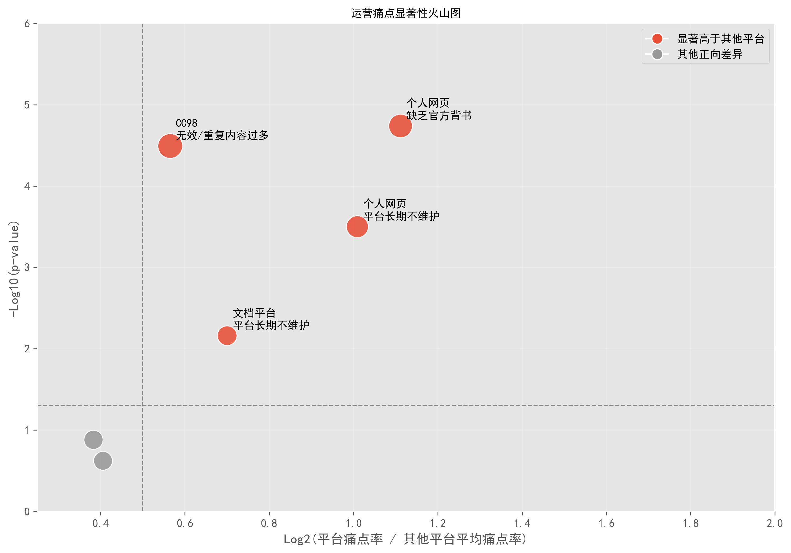

运营痛点热力图揭示了更深层次的结构性问题。CC98在"无效/重复内容过多"数值最高。这一结果指向了社区型平台的典型困境：由于缺乏内容审核和去重机制，多年积累的帖子中充斥着过期、重复甚至错误的资源，反而增加了用户的筛选成本。**个人网站的官方性不强，维护难度高，容易导致用户的长期信任危机**，对平台的延续和代际传承都带来了较大的挑战。

## **四、信息传播路径与信任机制：同辈社交网络是核心**

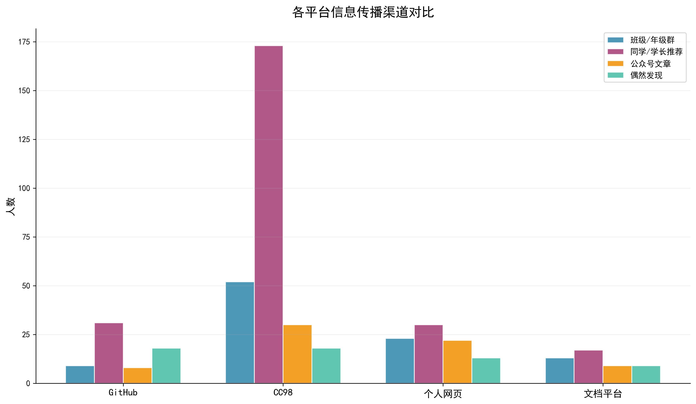

大部分平台的传播渠道都基本上满足「同学 / 学长推荐 > 班级 / 年级群 > 公众号文章 > 偶然发现」的规律。但有两组数据较为奇异。CC98基本上大部分都通过同学/学长推荐，猜测是学长组的宣传起到了重要的作用；而 GitHub 的「偶然发现」占比显著高于其他平台，这一差异直接反映出 GitHub 依托公开代码库、项目推荐机制形成的独特流量路径，用户更容易通过自主探索接触到平台资源。

这一分析的核心启示是：一个新平台如果想在校内迅速扩展用户规模，最有效的策略不是做公众号推广，而是**打通口口相传的社交推荐链路**。可以考虑设计"邀请码"等鼓励裂变机制，让每个老用户成为新用户的引路人。

## **交叉分析：年级差异与行为分层**

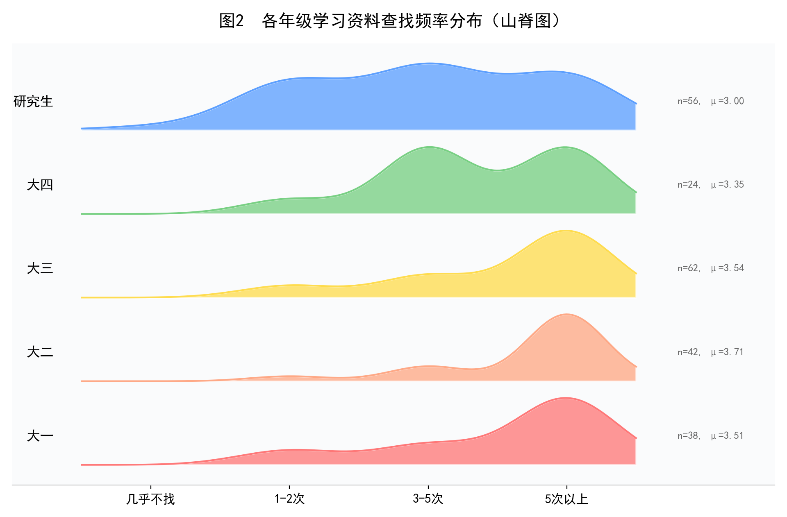

山脊图清晰地呈现了各年级学习资料查找频率的分布差异，大二学生资料查找需求最旺盛，说明大二阶段的课程难度提升与学习任务增加，推动了资料查找行为的高频发生；大三、大一的查找频率同样处于较高水平；研究生、大四整体平均查找频率相对较低。

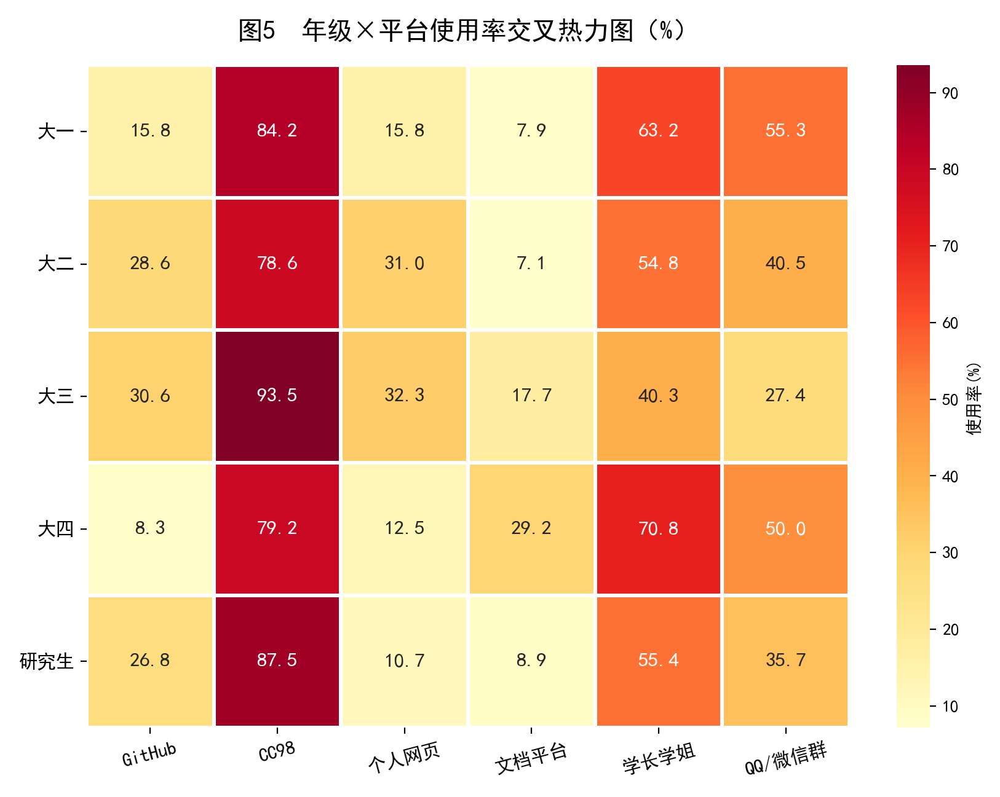

年级与平台使用率的交叉热力图呈现了几个值得深挖的发现。

首先，CC98的使用率在所有年级中都保持在极高水平（均超过75%）。

其次，GitHub的使用率呈现出总体的年级递增趋势。这一趋势的背后是编程能力和技术素养的积累——低年级学生对Git版本控制系统还不熟悉，直到修完计算机相关课程后才具备使用GitHub的门槛条件。

第三，"询问学长学姐"这一渠道在大一和大四学生中的使用率最高，大一新生由于尚未建立完善的资源获取习惯，更倾向于通过人际关系直接求助；大四面临未来去向选择问题，**直接寻找学长学姐仍然是重要的资源信息渠道**。这也表明了飞跃手册等经验手册建立和发展的迫切性。

## **建设理想的资源平台**

### **6.1 用户分享意愿调查：受益者即未来的建设者**

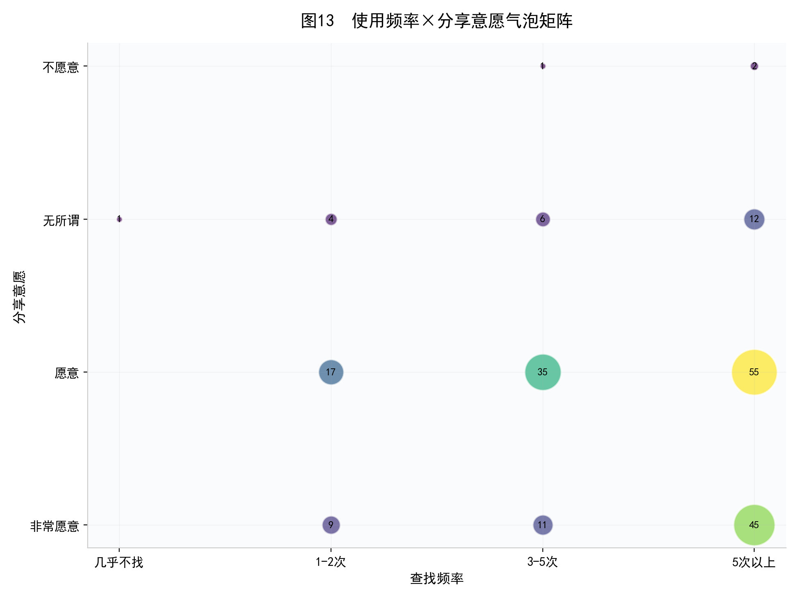

总体来看，85.6%的受访者表示"愿意"或"非常愿意"分享学习资料，仅1.4%（3人）明确表示"不愿意"。使用频率与分享意愿的气泡矩阵提供了另一个重要的交叉视角。最大的气泡集中在"5次以上×愿意"这一象限，表明高频使用者同时也是高意愿分享者。这一正相关关系在逻辑上合理：**越是频繁使用学习资源的学生，越能体会到获取高质量资源的困难，因此也更愿意分享自己的资料来改善这一生态。** 平台运营者应该重点锁定这一群体作为核心贡献者，为他们提供最优质的上传体验和最有力的激励回报。

### **6.2 上传体验的设计红线**

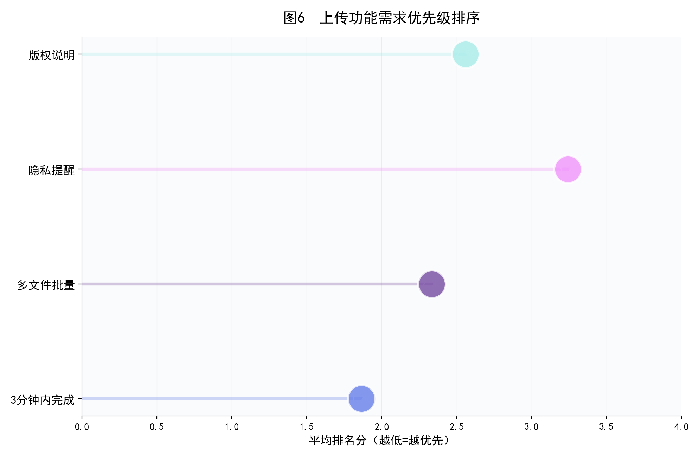

排名分析清晰表明，学生对上传功能的第一优先级是"3分钟内完成上传"（平均排名1.86分，分越低表示越优先）。紧随其后的是"支持多文件批量上传"（2.33分）和"明确资源归属/版权说明"（2.56分），"隐私等级提醒"排在最末（3.24分）。这一发现对平台设计有直接的指导意义：**上传流程必须做到极致简化**，"打开页面-选择文件-一键上传"应在三步之内完成，任何额外的填表、分类、标签步骤都可能成为劝退用户的障碍。

### **6.3 激励机制偏好**

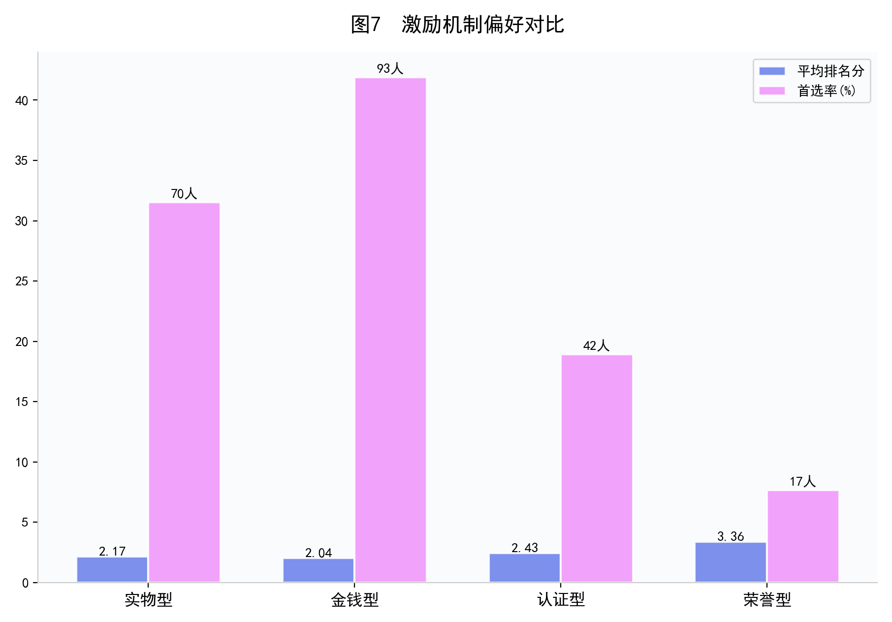

在四种激励方式中，金钱型（如发放一定金钱或优惠券）以2.04分的平均排名位居第一，实物型（如复印权限、资源下载权等）以2.17分紧随其后。认证型（如志愿时长、项目证书）排名第三（2.43分），荣誉型（如勋章、称号）排名最末（3.36分）。从首选率来看，选择金钱型为第一优先的人数最多，验证了"务实激励优于精神激励"的结论。**对于启动阶段的平台，应当优先采用金钱型激励和实物型来快速积累种子内容，等平台建立一定规模后再引入认证型和荣誉型机制维持长期贡献者的参与动力。** 对于校园资源平台来说，金钱型的可能性较低，实物型和认证型的可能性较高。

### **6.4 理想平台的核心特征**

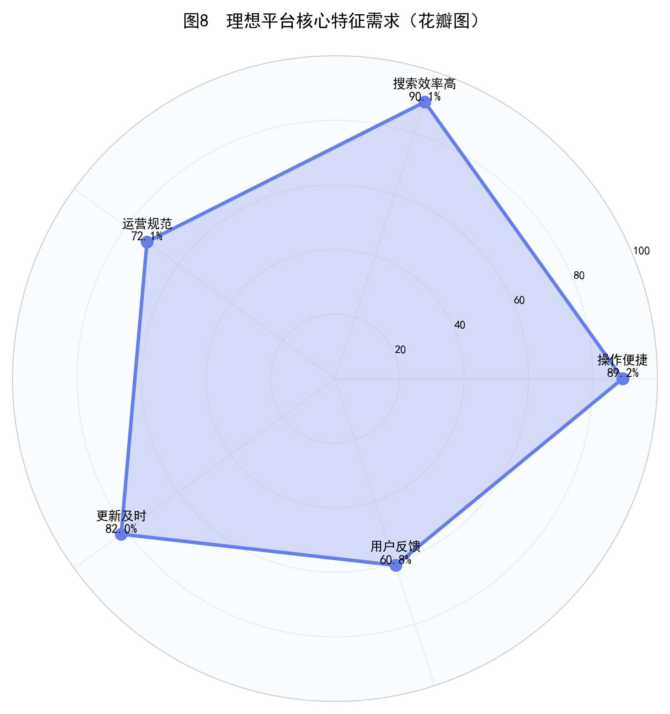

理想平台特征的花瓣图显示，排名前两位的特征是"搜索效率高"（90.1%）和"操作便捷"（89.2%），两者几乎并列。这再次印证了全报告的核心发现：**搜索能力是学习资源平台的第一生命线。** 学生不缺资源——CC98上积累了海量的课程笔记和真题，GitHub上也有不少高质量的课程仓库——他们缺的是一个能让他们在30秒内找到目标资源的高效搜索引擎。"更新及时"（82.0%）排名第三，反映了学生对资源时效性的焦虑。大学课程的教学大纲、考试重点每年都可能调整，两三年前的笔记可能已经与当前教学内容脱节。如何建立一套资源版本管理和定期更新的机制，是平台运营要解决的关键问题之一。

### **6.5 平台可持续性的四大支柱**

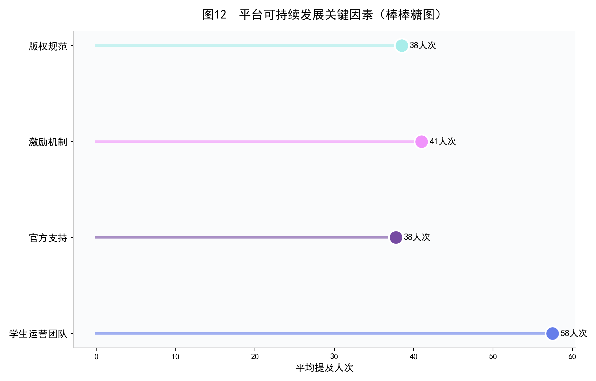

柱状图汇总了四大平台在"可持续发展关键因素"上的平均提及人次。"激励机制"和"学生运营团队"是被提及最多的两个因素，与前文分析形成呼应：学生清楚地认识到，**一个学习资源平台如果缺少持续的内容贡献激励和稳定的运维团队，迟早会走向衰落。**

### **七 综合建议**

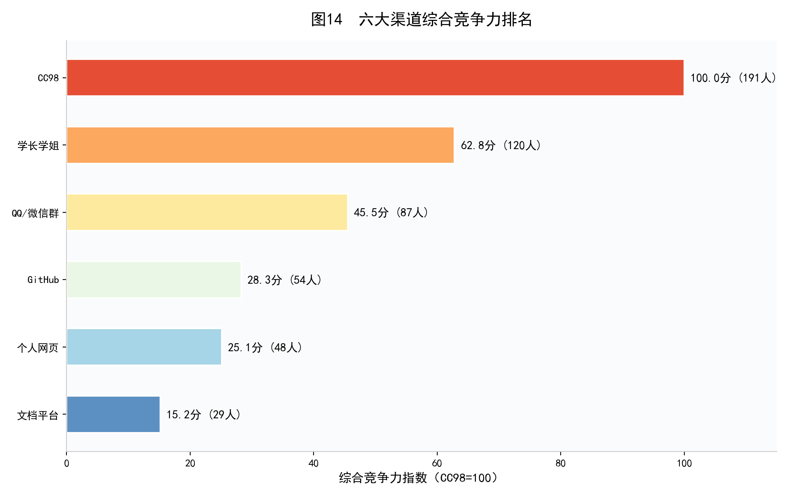

基于222份调研数据的全面分析，我们提出以下建议。

当前校内资源平台的首要短板集中在搜索效率上，90.1% 的学生将其列为理想平台的核心要求，而现有平台普遍存在索引混乱、检索不准的问题。新平台需彻底摒弃传统论坛的时间线式内容组织逻辑，搭建以课程、学科、学期为核心的结构化知识库，支持按课程名、授课教师、资料类型等多维度精准检索，同时加入智能去重功能，从根源上解决资源难找、信息冗余的痛点，确保学生能快速定位所需内容。

降低用户分享门槛是平台积累内容的关键，调研显示学生对上传功能的核心诉求是 3 分钟内完成操作。平台需设计极简上传流程，取消不必要的填表、分类、标签填写环节，仅保留核心信息录入，同时支持多文件批量上传；上传环节需嵌入简洁的版权归属说明提示，既保障分享便捷性，也规避版权风险，让学生愿意主动贡献笔记、真题等资料。

激励机制需贴合学生务实偏好，调研中金钱型、实物型激励最受青睐，结合校园场景实际，应优先落地实物激励与认证激励。平台启动阶段，可通过专属资源下载权限、校内复印额度等实物奖励，快速吸引学生上传真题、期末复习资料等高频刚需资源；平台步入成长期后，引入志愿时长认定、校园实践认证等机制，留存核心贡献者；后期再补充优质创作者勋章、专属标识等荣誉激励，构建长期可持续的贡献激励体系。

针对现有平台资源过期、无效内容过多的问题，需建立常态化内容治理机制。为每份上传资源强制标注适用学期、更新时间，对超过两个学年未更新的资源自动标记为待核验，由学生运营团队定期清理重复、失效、错误的内容，同时建立用户反馈通道，鼓励学生举报问题资源，保障平台内容的时效性与质量，避免学生筛选资源时耗费过多精力。

平台推广需依托校内熟人社交网络，调研表明同学、学长推荐是最有效的传播路径。可设计轻量化的邀请分享工具，联动各学院学生会、课程助教、新生学长组等校园关键节点，在迎新季、选课季、期末复习季等关键节点集中推广，打通资源从个人私藏到公共共享的转化链路，快速扩大平台的用户覆盖面与影响力。

## **八、结语**

本次调研基于 222 份覆盖大一至研究生、多院系的有效问卷，全面还原了浙大学生学习资源获取的真实行为与核心诉求。数据清晰显示，学生对课程笔记、历年真题等非正式学习资源的需求刚性且高频，超八成用户为中高频查找群体；CC98 论坛凭借社群优势成为校内资源共享的绝对主渠道，但信息架构不合理、内容治理缺失、检索效率低下等固有短板，已难以匹配学生高效获取资源的需求，为新平台的建设留下了明确的优化空间。

GitHub、个人网页、商业文档平台等补充渠道，分别受技术门槛高、长期维护不足、付费限制多等因素制约，未能形成规模化的资源共享效应。值得关注的是，85.6% 的学生愿意分享学习资料，且高频资源使用者往往是核心分享群体，学生群体的高分享意愿为新平台的冷启动提供了坚实基础，也充分印证了搭建专属高效学习资源平台的必要性与可行性。

本次调研精准定位了现有平台的差异化痛点，明确了理想学习资源平台的核心特征，为新平台的功能设计、流程优化、运营策略制定提供了扎实的数据支撑与方向指引。后续可结合平台实际使用行为日志、师生深度访谈等方式，进一步细化需求、完善方案，最终打造出贴合浙大师生实际需求、运营规范且可持续的学习资源共享平台，推动校内优质学习资源高效流转、价值最大化。

最后需要指出的是，问卷调研方法本身存在自选择偏差（愿意填写问卷的学生可能对学习资源话题更感兴趣）和社会期望效应（分享意愿可能被高估）的局限。后续研究可以考虑结合平台行为日志分析和深度访谈，进一步验证和细化本报告的发现。